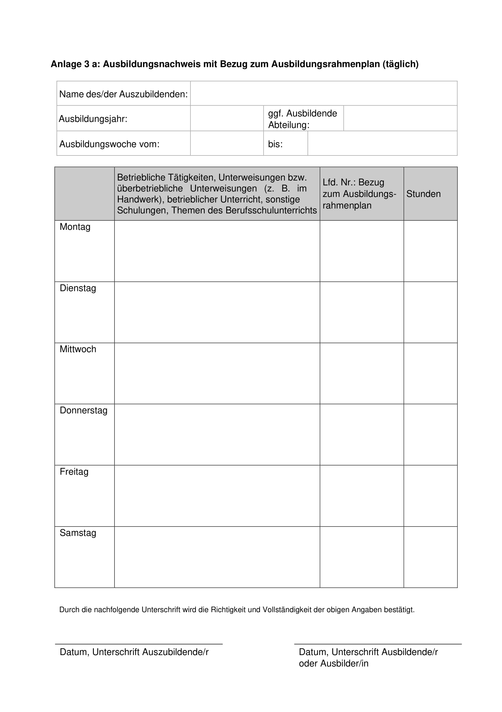

# AusbildungsnachweisGenerator
 Ein Programm, das Ausbildungsnachweise für alle Wochen der Ausbildung generiert

## Features

- Ausbildungsnachweise generieren
- Profile erstellen, speichern, exportieren und importieren
  - Profile enthalten alle Informationen eines Auszubildenden die für die erstellung der Ausbildungsnachweise nötig sind
- Vorschau der Dateistruktur
- Vorschau eines generierten Ausbildungsnachweises vor der Generierung
- Auswahl von mehreren Typen von Ausbildungsnachweisen (Täglich, Wöchentlich, mit und ohne Bezug zum Ausbildungsrahmenplan)
- Möglichkeit die Vorlagen anzupassen oder komplett auszutauschen (Anleitung im Programm)
- Volle Light- und Dark-Mode Unterstützung

## Download

Eine .zip/.7z Datei aus den [Releases](releases) herunterladen, entpacken und die `AusbildungsnachweisGenerator.exe` ausführen

- Es wird Windows 10 ab Build 19041 benötigt, entwickelt wurde das Programm für Windows 11
- Für die Frameworkabhängige Version wird, wenn nicht bereits vorhanden, [.NET 6.0](https://dotnet.microsoft.com/en-us/download/dotnet/6.0) benötigt
- Das Programm muss nicht installiert werden
- Es werden keine Administratorrechte benötigt
- Es werden keine Daten gesammelt o.ä., daher ist keine Internetverbindung notwendig

## Screenshots

### Startseite in der die Ausbildungsnachweise generiert werden

### Profile: Hier können die Profile erstellt und bearbeitet werden

### Vorlagen: Hier wird beschrieben wie man Voralgen bearbeitet und die Standardvorlagen werden angezeigt

### In den Einstellungen können die Profile exportiert und importiert werden

### Standard Ausbildungsnachweise

| | |
|---|---|
|| |
|||
|||

